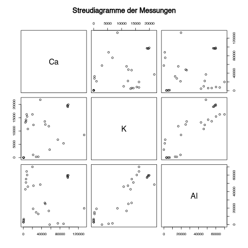
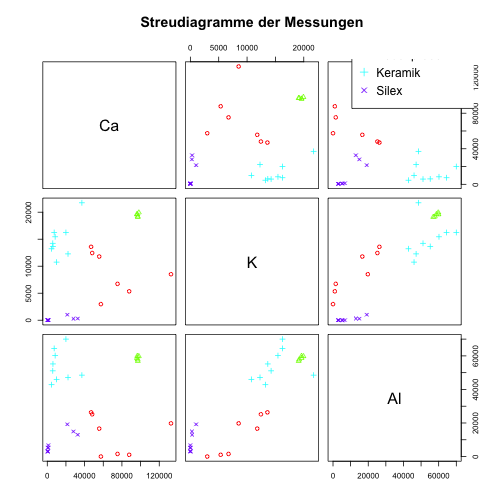
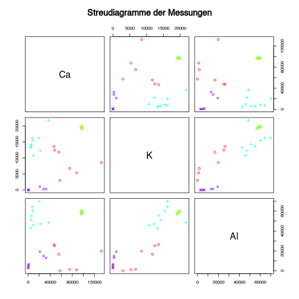
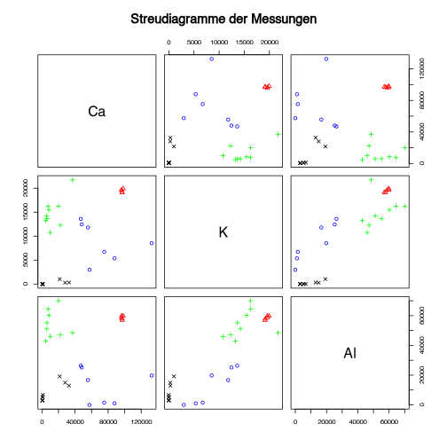
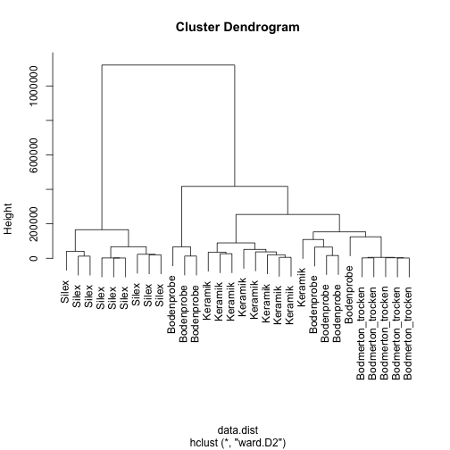
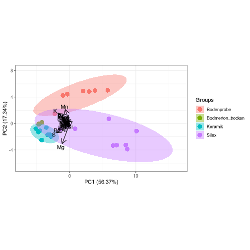

```r
library(pXRF)
```

Zuerst laden wir die bereinigten Daten ein:


```r
# Durch interaktive Wahl des Benutzers
#source_csv <- file.choose()

# Oder durch einen fest angestellten Pfad
source_csv <- "data_feinkalibriert.csv"

all_data <- read.csv(source_csv, row.names = 1)
```

Gegebenfalls können wir die Daten nun noch auf ein Kriterium hin filter, z.B. bezüglich des Messmodus (Type). Die zu filternde Spalte und den zu filternden Wert kann man entsprechend den Notwendigkeiten austauschen.


```r
data_ausw<-subset(all_data, Type == "Mining")
```

Als nächstes wollen wir die Daten hinsichtlich der Elementzusammensetzungen in Streudiagrammen darstellen, wobei immer die Werte bezüglich zweier Elemente gegeneinander geplottet werden.

Dazu kann man auf bestimmte Spalten, und damit auf bestimmte Elemente auswählen:


```r
elements_selected <- c("Nb", "Zr", "Y", "Sr", "Rb",  "Zn",  "Fe",  "Cr", "V", "Ti",  "Ca", "K", "Al",  "Si", "Th", "Pb", "Cu", "Ni", "Mn", "Ba", "P","S", "Mg")

# Alle Elemente: "Nb", "Zr", "Y", "Sr", "Rb", "Th", "Pb", "Zn", "Cu", "Ni", "Fe", "Mn", "Cr", "V", "Ti", "Ba", "Ca", "K", "Al", "P", "Si", "S", "Mg"
# Th, Pb, Cu, Ni, Mn, Ba, und Mg oft unkonstant gemessen resp. P und S Kontamination, daher eher weglassen...

data <- data_ausw[,elements_selected]
```
Jetzt kann man direkt den Plot vornehmen:


```r
pairs(data, main="Streudiagramme der Messungen")
```


Hier werden jetzt sehr viele Elemente gegeneinander geplotted. Man kann die Auswahl auch beschränken, durch Angabe einzelner Elemente, oder durch die Spaltennummern


```r
pairs(data[,c("Ca", "K", "Al")], main="Streudiagramme der Messungen")
```



Falls man untergruppen deutlich machen möchte, kann man dies mittels Symbolen und/oder Farben tun:


```r
groups <- factor(all_data$NOTE)
groups_num <- as.numeric(groups)
groups_count <- length(unique(groups))

pairs(data[,c("Ca", "K", "Al")],
      main="Streudiagramme der Messungen",
      col = rainbow(groups_count)[groups_num],
      pch = groups_num
      )
```


Um dies lesbarer zu machen, kann man noch eine Legende hinzufügen:


```r
pairs(data[,c("Ca", "K", "Al")],
      main="Streudiagramme der Messungen",
      col = rainbow(groups_count)[groups_num],
      pch = groups_num
      )
legend("topright", legend=unique(groups), pch = unique(groups_num), col = rainbow(groups_count)[unique(groups_num)])
```



Die Legende sitzt nicht schön (bzw. ausserhalb des Plotbereiches), daher platzieren wir sie oberhalb des Plots


```r
pairs(data[,c("Ca", "K", "Al")],
      main="Streudiagramme der Messungen",
      col = rainbow(groups_count)[groups_num],
      pch = groups_num, oma=c(10,3,3,3)
      )

legend("bottom", legend=unique(groups), pch = unique(groups_num), col = rainbow(groups_count)[unique(groups_num)],
       xpd=T, horiz = T)
```



Das gleiche nochmal etwas schöner, unter Nutzung einer vordefinierten Funktion


```r
library(car)
scatterplotMatrix(data[,c("Ca", "K", "Al")],
                  diagonal=list(method ="histogram", breaks="FD"),
                  smooth=FALSE)
```



Wir können auch zwei Elemente separat gegeneinander plotten:


```r
plot(data$Ca,
     data$K)
```


Oder schöner:


```r
scatterplot(data$Ca,
     data$K,groups=groups)
#> Warning in smoother(.x[subs], .y[subs], col = col[i], log.x = logged("x"), : could not fit smooth
```


## Mittelwerte und Standardabweichungen

Die Frage, ob sich die einzelnen Gruppen unterscheiden, macht sich ja daran fest, ob sich die Messwerte zwischen diesen unterscheiden. Dabei streuen die Messwerte innerhalb der Gruppen je Einzelmessung (gleiches oder unterschiedliches Objekt) ja auch mess- und materialbedingt. Das Kriterium, ob man Gruppen identifizieren kann, ist dabei, ob die Unterschiede innerhalb der Gruppen kleiner sind als die Unterschiede zwischen den Gruppen.

Hierzu sind zwei deskriptive Eigenschaften von Bedeutung:
- Der Mittelwert (oder einer der Varianten von Mittelwerten) gibt an, welche Werte die Gruppe insgesamt aufweist
- Die Standardabweichung gibt an, wie die Daten um diesen Mittelwert streuen.

Wir können uns diese Werte recht einfach mittels einer bequemen R-Funktion anzeigen lassen


```r
aggregate(data, list(groups), mean)
#>             Group.1        Nb        Zr        Y        Sr          Rb       Zn       Fe        Cr         V        Ti        Ca
#> 1        Bodenprobe  4.148786 109.68714 14.63614 199.36429  61.8206000 44.17877 15792.46  36.38971  21.88286 1268.0114 71983.337
#> 2 Bodmerton_trocken 13.662900 171.76600 23.86540 352.53000 106.9304800 66.71236 29038.66 102.78880 107.94400 3728.7020 96916.915
#> 3           Keramik 11.218444 134.03444 13.18344  64.85111  94.0035222 98.55413 28189.62 103.00889 103.50778 3282.8833 13523.699
#> 4             Silex  1.455611  92.86556 18.07144  23.13667   0.6843778 32.50303 11736.12   9.80000  22.79667  527.1956  9625.139
#>            K        Al       Si        Th       Pb        Cu       Ni        Mn          Ba         P           S        Mg
#> 1  8770.1205 12933.198 132877.9  4.457871 49.78246 12.767600  0.00000 621.09904    8.916429  659.0629    21.02471  348.9609
#> 2 19486.1226 58620.254 232490.7 14.496300 19.14808 27.774840 28.76896 543.66246 2570.620540  457.1700   821.10860 7245.9722
#> 3 14871.2877 53943.713 256588.6 13.953500 20.35667 15.402933 43.40001  55.06437  237.640956 2305.3689 19053.34744 7602.6097
#> 4   178.2422  8162.344 520152.1  0.000000  0.00000  2.603867  0.00000 270.44693   10.648267  248.6589   231.79722 3861.2687
aggregate(data, list(groups), median)
#>             Group.1      Nb     Zr      Y     Sr       Rb      Zn         Fe      Cr      V      Ti        Ca         K        Al
#> 1        Bodenprobe  3.6195 120.96 15.548 198.27  54.8269 31.1691 14516.8192  44.656  24.24 1616.74 57463.791  8514.891 16642.617
#> 2 Bodmerton_trocken 13.8415 173.50 23.530 351.39 106.9861 66.9285 28914.5064 102.136 109.54 3747.80 96896.499 19592.013 58713.073
#> 3           Keramik 11.3145 138.92 13.975  66.41  90.8666 93.1114 28192.8504 106.456 104.82 3347.78  8445.927 14239.344 51098.575
#> 4             Silex  0.0000   0.00 15.340  10.17   0.0000 31.2975   510.3904   0.000  11.39  237.20   913.269     0.000  5383.123
#>         Si      Th      Pb      Cu      Ni       Mn        Ba      P         S       Mg
#> 1 154210.5  0.0000 10.7136  0.0000  0.0000 462.6645    0.0000 194.96     0.000    0.000
#> 2 232685.5 13.6821 18.9472 30.4086 33.8437 546.6735 2566.9209 465.98   883.519 7006.873
#> 3 259230.1 16.4079 20.3236  0.0000  0.0000   0.0000  228.2272 337.14 11156.223 6357.827
#> 4 526194.5  0.0000  0.0000  0.0000  0.0000   0.0000    0.0000 229.17     0.000 1890.759
aggregate(data, list(groups), sd)
#>             Group.1        Nb         Zr          Y        Sr        Rb        Zn        Fe        Cr        V        Ti         Ca
#> 1        Bodenprobe 3.3477570  50.019187  7.0396868 53.603027 26.514646 38.582532 10904.376 20.211533 21.93813 729.52042 30565.9848
#> 2 Bodmerton_trocken 0.5977607   3.830115  0.9035888  3.300598  1.415240  2.269503   380.175  4.009671 16.96578  88.08895   766.6247
#> 3           Keramik 1.7338635  21.985727  4.4281578 14.702635  8.620389 35.922044  6994.825 16.643813 20.10917 622.50568 10851.4002
#> 4             Silex 2.1882956 140.442675 21.2431749 21.776453  1.359933 44.130806 14287.856 20.522302 25.55750 585.19663 13624.8538
#>           K        Al       Si       Th         Pb        Cu       Ni        Mn       Ba          P          S        Mg
#> 1 3985.9489 11750.940 74130.06 5.798350 76.5879378 21.999829  0.00000 451.82378 23.59065  931.47167    40.1129  923.2636
#> 2  342.4104  1275.231  1620.37 1.543405  0.6691061  6.012904 16.31789  15.01090 35.87299   47.69562   217.1251  576.6631
#> 3 3152.4474  9209.352 30797.56 6.260604  3.7453235 19.558400 57.74400  65.92515 59.41894 3661.75389 24395.6095 3635.1287
#> 4  339.5079  6003.581 41493.61 0.000000  0.0000000  7.811600  0.00000 398.37450 31.94480  231.33505   362.2640 3949.5296
```

Dies bleibt jedoch in der puren Zahlenansicht nicht sehr intuitiv. Eine Graphische Darstellung wie ein Boxplot ist hier hilfreicher. Für einzelne Element geht das gut mit der Standard-Graphik


```r
boxplot(data$Si ~ groups)
```


Für komplexere Darstellungen (viele Elemente + Gruppen gleichzeitig) gibt es die ggplot Bibliothek. Als erstes müssen wir dazu unsere Daten in das "Lange" format übertragen


```r
library(reshape2)
data_long <- melt(cbind(data,groups))
#> Using groups as id variables
```

Jetzt können wir diese dann auch mit Standard-Graphik darstellen, das bleibt aber unbefriedigend, da es sehr viele Elemente hat, die sich auch in ihren Messbereichen deutlich unterscheiden:


```r
boxplot(value ~ variable + groups, data = data_long)
```


Besser ist es, wenn wir die einzelnen Plots per Element unterteilen


```r
library(ggplot2)

ggplot(data = data_long) + geom_boxplot(aes(fill=groups, y = value)) + facet_wrap(.~variable, scales = "free_y")
```


Wollen wir nun schauen, ob sich 2 Gruppen in Bezug auf ihre Ausprägungen in Einzelnen Elementen signifikant unterscheiden, so können wir einen einfachen nichtparametrischen Test anwenden, wie z.B. den Wilcoxon Rang-Summen-Test.


```r
wilcox.test(data$Si[groups=="Keramik"], data$Si[groups=="Silex"])
#> 
#> 	Wilcoxon rank sum exact test
#> 
#> data:  data$Si[groups == "Keramik"] and data$Si[groups == "Silex"]
#> W = 0, p-value = 4.114e-05
#> alternative hypothesis: true location shift is not equal to 0
```

oder für alle Gruppen zugleich

```r
pairwise.wilcox.test(data$Si, groups)
#> 
#> 	Pairwise comparisons using Wilcoxon rank sum exact test 
#> 
#> data:  data$Si and groups 
#> 
#>                   Bodenprobe Bodmerton_trocken Keramik
#> Bodmerton_trocken 0.00505    -                 -      
#> Keramik           0.00400    0.18981           -      
#> Silex             0.00087    0.00400           0.00025
#> 
#> P value adjustment method: holm
```

## PCA

Um latente Variablen zu identifizieren, die mehrere (oder alle) Elemente gleichzeitig beeinflussen, bietet sich die Hauptkomponentenanalyse (principal component analysis, pca) an. Hierzu dürfen keine NA-Werte in den Daten vorhanden sein. Filtern wir sicherheitshalber erst mal dazu in dieser Hinsicht:


```r
# 1 for rows, 2 for columns
na_columns <- apply(data,2,anyNA)

data.for_pca <- data[,!na_columns]
```

Jetzt können wir die Hauptkomponentenanalyse selbst durchführen:


```r
data.pca <- prcomp(data.for_pca)
```

und darstellen


```r
biplot(data.pca)
#> Warning in arrows(0, 0, y[, 1L] * 0.8, y[, 2L] * 0.8, col = col[2L], length = arrow.len): zero-length arrow is of indeterminate angle and
#> so skipped

#> Warning in arrows(0, 0, y[, 1L] * 0.8, y[, 2L] * 0.8, col = col[2L], length = arrow.len): zero-length arrow is of indeterminate angle and
#> so skipped

#> Warning in arrows(0, 0, y[, 1L] * 0.8, y[, 2L] * 0.8, col = col[2L], length = arrow.len): zero-length arrow is of indeterminate angle and
#> so skipped

#> Warning in arrows(0, 0, y[, 1L] * 0.8, y[, 2L] * 0.8, col = col[2L], length = arrow.len): zero-length arrow is of indeterminate angle and
#> so skipped

#> Warning in arrows(0, 0, y[, 1L] * 0.8, y[, 2L] * 0.8, col = col[2L], length = arrow.len): zero-length arrow is of indeterminate angle and
#> so skipped

#> Warning in arrows(0, 0, y[, 1L] * 0.8, y[, 2L] * 0.8, col = col[2L], length = arrow.len): zero-length arrow is of indeterminate angle and
#> so skipped

#> Warning in arrows(0, 0, y[, 1L] * 0.8, y[, 2L] * 0.8, col = col[2L], length = arrow.len): zero-length arrow is of indeterminate angle and
#> so skipped

#> Warning in arrows(0, 0, y[, 1L] * 0.8, y[, 2L] * 0.8, col = col[2L], length = arrow.len): zero-length arrow is of indeterminate angle and
#> so skipped

#> Warning in arrows(0, 0, y[, 1L] * 0.8, y[, 2L] * 0.8, col = col[2L], length = arrow.len): zero-length arrow is of indeterminate angle and
#> so skipped

#> Warning in arrows(0, 0, y[, 1L] * 0.8, y[, 2L] * 0.8, col = col[2L], length = arrow.len): zero-length arrow is of indeterminate angle and
#> so skipped

#> Warning in arrows(0, 0, y[, 1L] * 0.8, y[, 2L] * 0.8, col = col[2L], length = arrow.len): zero-length arrow is of indeterminate angle and
#> so skipped
```


Häufig unterscheiden sich die einzelnen Elemente hinsichtlich der Grössenordnung ihrer Messwerte. Um besonders häufig enthaltene Element nicht überzubewerten, bzw. um Spurenelement nicht unterzubewerten, bietet es sich an, diese auf ein gleiches Mass zu normieren. Hierzu wird die sogenannte z-Transformation angewendet, die für alle Werte:

- den Mittelwert pro Element bestimmt und diesen von allen Elementen subtrahiert. Dadurch wird der Mittelwert für alle auf Null gesetzt.
- die Standardabweichung für alle Elemente bestimmt und durch diese teilt. Damit haben alle Elemente eine Standardabweichung von 1.

Dadurch werden die Grössenordnungen aller Elemente angeglichen, und ihr Einfluss auf die PCA damit ebenso. In R können wir das durch eine einfache Zugabe einer weiteren Option erreichen:


```r
data.pca_scaled <- prcomp(data.for_pca, scale. = T)
```

Und wiederum dargestellt:


```r
biplot(data.pca_scaled)
```


oder in ggplot


```r
#install_github('fawda123/ggord')
library(ggord)
#> Error in library(ggord): there is no package called 'ggord'

ggord(data.pca_scaled, groups, vec_ext = 5, exp = c(.1,.1))
#> Error in ggord(data.pca_scaled, groups, vec_ext = 5, exp = c(0.1, 0.1)): could not find function "ggord"
```

Eine weitere Möglichkeit, die Daten vorzubehandeln, um den Einfluss extremer Werte und Wertunterschiede zu verringern, ist die die Transformation, z.B. mittels des Logarithmus (zur Basis 10). Hierbei werden die ordinalen Unterschiede zwischen den einzelnen Messwerten bzw. Elementen nicht gänzlich aufgelöst, sondern nur abgeschwächt. Analog zur z-Transformation ist die Durchführung nicht kompliziert. Allerdings ist zu beachten, dass sich kein log10 von 0 bilden lässt. Daher bietet es sich an, auf jeden Werte einen (sehr kleinen) Wert aufzuaddieren, damit diese Problem umgangen wird.


```r
data.pca_log10 <- prcomp(log10(data.for_pca+0.1))
ggord(data.pca_log10, groups, vec_ext = 5, exp = c(.1,.1))
#> Error in ggord(data.pca_log10, groups, vec_ext = 5, exp = c(0.1, 0.1)): could not find function "ggord"
```

## Clusteranalyse

Die Clusteranalyse ist ein Werkzeug, um Gruppenzugehörigkeit aufgrund von unterschiedlichen Merkmalen mittels eines Algorithmus zu definieren. Hierbei werden aufgrund von unterschiedlichen Verfahren Ähnlichkeiten zwischen den einzelnen Objekten festgelegt, und dann die jenigen Objekte zu Gruppen zusammen gefügt, die sich am ähnlichsten sind.

Hierzu gibt es verschiedene Herangehensweisen. Eine Variante ist die so genannte hierarchische Clusteranalyse, bei der schrittweise Objekte in absteigender Ähnlichkeit zu einander zusammen gepackt werden. Hieraus entsteht ein so genannter Baum, der angebt, in welcher Reihenfolge Gruppierungen vorgenommen worden sind.

Da wir es mit Messwerten zu tun haben, können wir für die Bestimmung von Ähnlichkeiten die euklidische Distanz benutzen. Das ist das Distanzmass, dass man auch aus dem Alltag kennt. Man kann es als Abstand in Bezug auf X und Y Koordinaten sehen. Mathematisch können aber auch beliebig viele Dimensionen berücksichtigt werden.

Die Funktion, um diese Distanzen zu berechnen, ist die Funktion dist(). Ohne weitere Angabe der Distanzfunktion wird euklidische Distanz hiermit berechnet.


```r
data.dist <- dist(data)
```

Die eigentliche Gruppierung in Cluster erfolgt nun mittels der Funktion hclust(). Auch für diese gibt es verschiedene Methoden. Für kritische Distanzen bietet sich die so genannte ward-Methode an.


```r
data.hclust <- hclust(data.dist, method = "ward.D2")
```

Zur Darstellung des Clusterbaums kann man nun das entstandene Objekt einfach mit der Plotfunktion darstellen.


```r
plot(data.hclust)
```


An den einzelnen Ästen des Baumes sind am Ende jeweils die Zeilen Namen der Objekte angetragen. Man kann diese jedoch auch zum Beispiel durch die Gruppenzugehörigkeit ersetzen. Hierzu wird die gewünschte Variable als "labels" mit angegeben


```r
plot(data.hclust,labels = groups)
```



Eine hierarchische Clusteranalyse produziert nicht ausschliesslich eine Lösung, sondern einen Ähnlichkeitsbaum. Möchten wir uns nun auf eine Anzahl von Clustern festlegen, so müssen wir "diesen Baum fällen". Der Befehl hier zu lautet cutree().


```r
data.clusters <- cutree(data.hclust, k=4)
data.clusters
#>  1  2  3  4  5  6  7  8  9 10 11 12 13 14 15 16 17 18 19 20 21 22 23 24 25 26 27 28 29 30 
#>  1  1  1  1  1  1  1  1  2  2  2  1  3  3  3  3  3  1  3  3  3  4  4  4  4  4  4  4  4  4
```

Die daraus abgeleiteten Gruppen Zugehörigkeiten können wir nun nutzen, um eine Darstellung, zum Beispiel eine Hauptkomponentenanalyse, mit den abgeleiteten Gruppen ein zu färben.


```r
plot(data.pca$x[,1],data.pca$x[,2], col = data.clusters)
```


Ein weiteres Clusterverfahren ist das so genannte kmeans-Verfahren. Dieses produziert häufig bessere Ergebnisse, verlangt aber, dass die Daten in euklidischen Distanz vorliegen. Zudem muss man vorher angeben, wie viel Cluster man erwartet. Genau diese Anzahl von Clustern wird dann auch eingeteilt.


```r
data.kmeans <- kmeans(data, 4)
```

Auch diese Lösung können wir dann verwenden, um eine Darstellung entsprechend der Clusterzugehörigkeit ein zu färben.


```r
plot(data.pca$x[,1],data.pca$x[,2], col = data.kmeans$cluster)
```


## Diskriminanzanalyse (lda)

Die Diskriminanzanalyse ist ein Verfahren, um herauszufinden, welche Elemente zwei Gruppen in einem Datensatz am besten unterscheiden. Das heisst, wir haben schon eine Gruppeneinteilung, und möchten nun herausfinden, worin die Unterschiede zwischen diesen Gruppen bestehen.


```r
library(MASS)
data.for_lda <- data
data.for_lda$groups <- groups
data.lda <- lda(groups ~ ., data = data.for_lda)
data.lda
#> Call:
#> lda(groups ~ ., data = data.for_lda)
#> 
#> Prior probabilities of groups:
#>        Bodenprobe Bodmerton_trocken           Keramik             Silex 
#>         0.2333333         0.1666667         0.3000000         0.3000000 
#> 
#> Group means:
#>                          Nb        Zr        Y        Sr          Rb       Zn       Fe        Cr         V        Ti        Ca
#> Bodenprobe         4.148786 109.68714 14.63614 199.36429  61.8206000 44.17877 15792.46  36.38971  21.88286 1268.0114 71983.337
#> Bodmerton_trocken 13.662900 171.76600 23.86540 352.53000 106.9304800 66.71236 29038.66 102.78880 107.94400 3728.7020 96916.915
#> Keramik           11.218444 134.03444 13.18344  64.85111  94.0035222 98.55413 28189.62 103.00889 103.50778 3282.8833 13523.699
#> Silex              1.455611  92.86556 18.07144  23.13667   0.6843778 32.50303 11736.12   9.80000  22.79667  527.1956  9625.139
#>                            K        Al       Si        Th       Pb        Cu       Ni        Mn          Ba         P           S
#> Bodenprobe         8770.1205 12933.198 132877.9  4.457871 49.78246 12.767600  0.00000 621.09904    8.916429  659.0629    21.02471
#> Bodmerton_trocken 19486.1226 58620.254 232490.7 14.496300 19.14808 27.774840 28.76896 543.66246 2570.620540  457.1700   821.10860
#> Keramik           14871.2877 53943.713 256588.6 13.953500 20.35667 15.402933 43.40001  55.06437  237.640956 2305.3689 19053.34744
#> Silex               178.2422  8162.344 520152.1  0.000000  0.00000  2.603867  0.00000 270.44693   10.648267  248.6589   231.79722
#>                          Mg
#> Bodenprobe         348.9609
#> Bodmerton_trocken 7245.9722
#> Keramik           7602.6097
#> Silex             3861.2687
#> 
#> Coefficients of linear discriminants:
#>              LD1           LD2           LD3
#> Nb -1.342423e+00 -1.191953e+00 -9.514850e-01
#> Zr  1.393259e-01  3.440068e-02 -4.895325e-02
#> Y   1.178440e-01  1.801195e-01  1.491091e-01
#> Sr -3.777148e-01  1.088795e+00  5.223913e-01
#> Rb -2.472696e-01  9.795943e-01 -2.516156e-01
#> Zn  6.659356e-02 -2.441169e-02 -4.178613e-02
#> Fe  4.311102e-05 -2.519501e-04 -2.007874e-05
#> Cr  1.397468e-01  3.084998e-01  1.345176e-01
#> V  -4.650117e-02  1.938609e-01  1.098824e-01
#> Ti  1.364064e-03 -3.171044e-02 -1.179795e-04
#> Ca  2.902568e-04 -1.478700e-03 -7.743339e-04
#> K  -1.101150e-03 -3.434939e-03 -5.461069e-04
#> Al -9.082074e-05  1.781465e-04 -4.731518e-04
#> Si  1.829082e-04  8.123467e-05  1.432571e-04
#> Th -4.242434e-01 -4.306767e-01 -8.285838e-02
#> Pb -1.090543e-01  1.582700e-02 -4.177434e-02
#> Cu -7.853595e-02 -6.438674e-03  9.319606e-02
#> Ni  4.169052e-03  9.349904e-02 -2.263877e-03
#> Mn -1.263092e-02  3.029440e-02  2.778091e-02
#> Ba -1.957177e-02 -8.600464e-02 -3.324197e-03
#> P   1.126360e-03  3.644112e-03  7.002900e-04
#> S  -7.875454e-05 -3.875140e-04  9.071944e-06
#> Mg -6.833230e-04 -1.280120e-04  7.246852e-04
#> 
#> Proportion of trace:
#>    LD1    LD2    LD3 
#> 0.7081 0.2011 0.0907
```

Die Werte zeigen zuerst die Anteile der jeweiligen Gruppen, dann deren Mittelwerte bezüglich der Elemente, schliesslich die Diskriminanzkoeffizienten. Diese zeigen auf, ob ein Element eher auf die Zugehörigkeit zur einen oder zur anderen Gruppe hinweist. Deutlicher wird dies, wenn wir und das dazu noch graphisch darstellen:


```r
plot(data.lda)
```



Schöner mit Paketen, die auf ggplot basieren:


```r
ggord(data.lda, data.for_lda$groups, vec_ext = 40, exp = c(.1,.1))
#> Error in ggord(data.lda, data.for_lda$groups, vec_ext = 40, exp = c(0.1, : could not find function "ggord"
```

