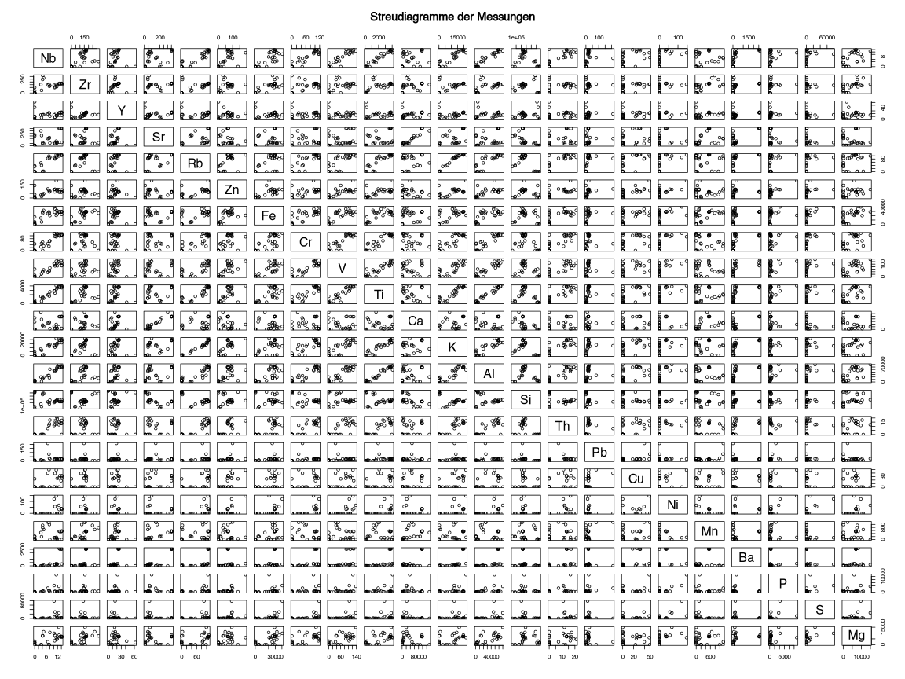
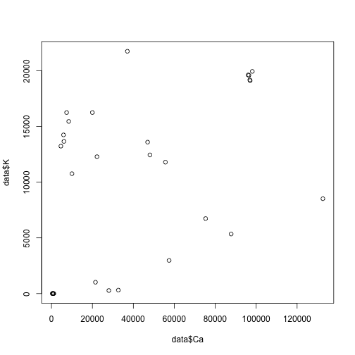
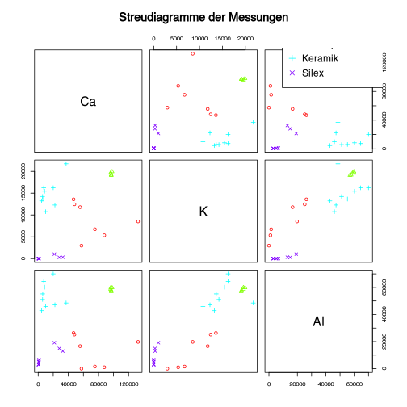
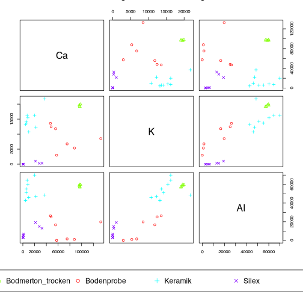
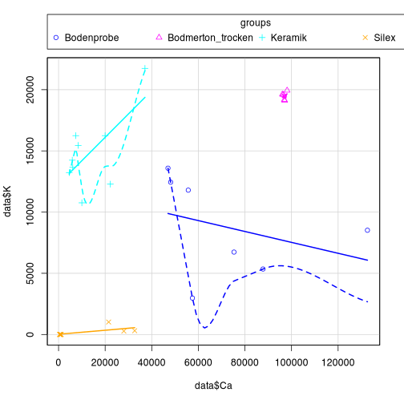

```r
library(pXRF)
```

## Feinkalibration

Um die Daten an die Messgenauigkeit einer stationären XRF anzunähern, bzw. um die spezifischen systematischen Abweichungen unseres speziellen Gerätes auszugleichen, kann eine Feinkalibration durchgeführt werden. Hierzu benötigt man die Messungen der gleichen Materie mittels beider Geräte. Die Messergebnisse können dann in Beziehung gebracht werden, und Korrekturfaktoren können erstellt werden.

Hierzu benötigen wir zuerst einen Datensatz, der beide Messungen für eine grössere Zahl von Objekten enthält. Diese Daten können unterschiedlich strukturiert sein, wir haben in unserem Fall eine Tabelle, die die Elementmessungen enthält, und zusätzlich einen Identifizierer für die Messmethode und einen für die Probe enthält.


```r
fine_calibration_data_mining.raw_data <- read.csv("../inst/extdata/fine_calibration_data_mining.raw_data.csv")
```

Nehmen wir den Datensatz mal in zwei einzelne Variablen auseinander


```r
pxrf <- fine_calibration_data_mining.raw_data[fine_calibration_data_mining.raw_data$method=="pXRF",]
wdrfa <- fine_calibration_data_mining.raw_data[fine_calibration_data_mining.raw_data$method=="WD RFA",]
```

Wenn wir jetzt auf der y-achse die Messungen des stationären, und auf der x-Achse die des pXRF Gerätes plotten (erstmal für ein Element), dann können wir uns diese Beziehung ansehen:


```r
plot(pxrf$Si,
     wdrfa$Si,
     xlab = "pXRF",
     ylab = "WD RFA")
```


Betrachten wir nur den Datenbereich, so gibt es hier eine deutliche Streuung. Wenn wir den Blickwinkel erweitern, und auch die Nullstelle miteinbeziehen, dann sieht die Beziehung schon linearer aus:


```r
plot(pxrf$Si,
     wdrfa$Si,
     xlab = "pXRF",
     ylab = "WD RFA",
     xlim = c(0,400000),
     ylim = c(0,400000),
     asp = 1
     )
```



Hieraus können wir nun verschiedene Dinge bestimmen. Zum einen können wir "Übersetzungsfaktoren" bestimmen, die angeben, wie die Messung auf dem einen Gerät in eine Messung auf dem anderen zu überführen wäre. Das sind die Koeffizienten. Das andere ist die Güte, mit der eine solche Übertragung möglich ist. Dies wird allgemein mit dem Determinationskoeffizienten bestimmt, der auch als R² abgekürzt wird.

Beginnen wir mit den Koeffizienten. Hierzu bestimmen wir die Linie, die mit dem geringsten Abstand zu allen Punkten hindurch führt. Dies nennt man dann auch Lineares Model (lm).


```r
lineares_modell <- lm(wdrfa$Si ~ pxrf$Si)
plot(pxrf$Si,
     wdrfa$Si,
     xlab = "pXRF",
     ylab = "WD RFA",
     xlim = c(0,400000),
     ylim = c(0,400000),
     asp = 1
     )
abline(lineares_modell)
```


Aus diesem Modell können wir nun die Übersetzungsparameter herleiten:


```r
lineares_modell$coefficients
#>  (Intercept)      pxrf$Si 
#> 1.081981e+05 6.684396e-01
```

Dieses Modell besagt, dass wenn das pXRF 0 messen würde, dies mit dem Wert 10820 im stationären XRF zu übersetzen wäre. Und für jede weitere Einheit der Messung auf dem pXRF sind 0.67 auf diesen Wert aufzuaddieren.

Dies ergibt sich aber unter anderem dadurch, dass wir keine Messungen mit so geringen Silizium-Werten vorliegen haben. Wenn wir daher davon ausgehen, das beim Nichtvorhandensein des Elementes beide Geräte 0 anzeigen, dann ergibt sich ein etwas anderes Modell:


```r
lineares_modell <- lm(wdrfa$Si ~ 0 + pxrf$Si)
plot(pxrf$Si,
     wdrfa$Si,
     xlab = "pXRF",
     ylab = "WD RFA",
     xlim = c(0,400000),
     ylim = c(0,400000),
     asp = 1
     )
abline(lineares_modell, col="red")
```


Hier geben wir an, dass wir davon ausgehen, dass es keinen Versatz für den 0-Wert gibt (daher 0 in der Formel), und dass alle Effekte nur über einen systematischen Fehler des pXRF zu erklären sind.

Daraus ergeben sich folgende(r) Koeffizient:


```r
lineares_modell$coefficients
#>  pxrf$Si 
#> 1.063579
```

Das bedeutet also, dass wir den Wert des pXRF für Silizium mal 1.063579 nehmen, um den equivalenten Wert für das WD-XRF zu erhalten, der mit diesem gemessen worden wäre.

Für dieses Modell können wir (ebenso wie für das vorgehende Modell) den Determinationskoeffizienten berechnen (lassen):


```r
summary(lineares_modell)$r.squared
#> [1] 0.9886833
```

Das bedeutet, dass sich nahezu 99% der Variabilität in den WD-XRF-Daten durch die pXRF Daten erklären lassen, und nur 1% zufällige Streuung ist.

## Outlier

Schauen wir uns das ganze mal für Kupfer an:


```r
plot(pxrf$Cu,
     wdrfa$Cu,
     xlab = "pXRF",
     ylab = "WD RFA"
     )
```



Hier gibt es zwei Punkte, die ganz klar und deutlich sich von allen anderen absetzen. Das können Daten- oder Messfehler sein. Diese Extremwerte beeinflussen sehr stark unser Lineares Modell, und machen es daher schlecht angepasst für den grössten Teil der Daten:


```r
plot(pxrf$Cu,
     wdrfa$Cu,
     xlab = "pXRF",
     ylab = "WD RFA"
     )
abline(lm(wdrfa$Cu~pxrf$Cu))
```



Es kann also sehr sinnvoll sein, diese Extremwerte nicht in die Berechnung einzubeziehen. Man kann nun (und das ist sicher die bessere Methode) diese Werte einzeln bestimmen. Oder man überlässt dies einem Algorithmus.

Ein Ansatz ist der, der auch im Boxplot verwendet wird:


```r
boxplot(wdrfa$Cu)
```



Die meisten Messwerte sind im unteren Bereich, aber zwei Werte sind deutlich höher gemessen im WDXRF, was auf eine Verunreinigung hinweisen könnte. Das Mass ist hier die Box des Boxplots: Diese entspricht den werten der mittleren Hälfte der Daten. Wenn ein Wert mehr als 1.5x der Grösse dieser Spanne, gemessen von derer oberen bzw. unteren Grenze, abweicht, so wird er als Ausreisser verstanden.

Wir könnten die in dem Boxplot eingebaute Funktion nutzen, oder wir schreiben sie zum besseren Verständnis kurz selbst:


```r
iqr <- IQR(wdrfa$Cu) # interquartile
quantiles <- quantile(wdrfa$Cu)
outlier <- wdrfa$Cu > quantiles[4] + iqr * 1.5 | wdrfa$Cu < quantiles[2] - iqr * 1.5
wdrfa$Cu[outlier]
#> [1] 198  91
```

Das identifiziert uns die beiden Outlier. Jetzt verbinden wir diesen Ansatz in einer Funktion mit dem Linearen Modell zu einer robusten Regression:


```r
outlier <- function(x) {
iqr <- IQR(x) # interquartile
quantiles <- quantile(x)
outlier <- x > quantiles[4] + iqr * 1.5 | x < quantiles[2] - iqr * 1.5
outlier
}

robust_lm <- function(x,y) {
  outlier_x <- outlier(x)
  outlier_y <- outlier(y)
  lm(y[!(outlier_x | outlier_y)] ~ 0 + x[!(outlier_x | outlier_y)])
}

robust_lm(pxrf$Cu, wdrfa$Cu)
#> 
#> Call:
#> lm(formula = y[!(outlier_x | outlier_y)] ~ 0 + x[!(outlier_x | 
#>     outlier_y)])
#> 
#> Coefficients:
#> x[!(outlier_x | outlier_y)]  
#>                       1.173
```

Und nun noch darstellen, erst gegen den gesamten Datensatz:


```r
plot(pxrf$Cu,
     wdrfa$Cu,
     xlab = "pXRF",
     ylab = "WD RFA"
     )
abline(robust_lm(pxrf$Cu, wdrfa$Cu))
```



Und nun gegen den Datensatz, der keine Outlier mehr enthält:


```r
plot_without_outlier <- function(x,y,...) {
  outlier_x <- outlier(x)
  outlier_y <- outlier(y)
  plot(x[!(outlier_x | outlier_y)],y[!(outlier_x | outlier_y)],...)
}

plot_without_outlier(pxrf$Cu,
     wdrfa$Cu,
     xlab = "pXRF",
     ylab = "WD RFA"
     )
abline(robust_lm(pxrf$Cu, wdrfa$Cu))
```


```r

residuals(lineares_modell)
#>           1           2           3           4           5           6           7           8           9          10 
#> -29819.6334 -19055.3006  29218.5270 -21022.3129 -44030.9814  15011.7521  -5019.5831 -31794.4390 -28104.8771 -10535.1431 
#>          11          12          13          14          15          16          17          18          19          20 
#>   -280.1775 -30113.9707   4034.4376 -36558.3590 -27927.0121  42059.2824 -36895.1966  -9597.1636 -27035.5455 -35410.9249 
#>          21          22          23          24          25          26          27          28          29          30 
#> -52385.6919 -20702.2737 -52822.2603 -38752.2086 -17799.8076  23091.3110 -44450.1586  -3130.7971  12890.9028  -4558.3229 
#>          31          32          33          34          35          36          37          38          39          40 
#>  23772.8545  -2877.7227  33479.3646 -19212.9317  61230.3004   1954.2830 -38212.9310  13103.6233 -18333.5724 -15056.6477 
#>          41          42          43          44          45          46          47          48          49          50 
#>  -6321.4465  36704.9332 -33218.9256    997.5160 -17222.1180   5674.6377  21482.1247  14157.4851  26814.7651   1035.7102 
#>          51          52          53          54          55          56          57          58          59          60 
#>   -270.4783  -2865.8774  -1334.1172   4056.0667  37975.6683  43711.9817 -28470.1392  66417.6996  24364.0653  28069.5509 
#>          61          62          63          64          65          66          67          68          69          70 
#>  13753.6146  17392.2860  30261.9679  57293.6775  -3874.6628  26714.4998 -23115.4523  49076.7777  16307.4657 -23415.3748 
#>          71          72          73          74          75          76          77          78          79          80 
#> -11392.9091  58303.2552  39536.0173   -959.5165 -23447.4274 -22448.0539 -15503.3899  -8046.4512   1862.4854 -10044.5362 
#>          81          82          83          84          85          86          87          88          89          90 
#> -13665.4036  -8827.9298  42494.9668  36301.2604 -32457.9245 -10522.8819 -29070.9979  25583.9645 -23076.6108  52963.9518 
#>          91          92          93          94          95          96          97          98          99         100 
#>  -4693.2720  72971.4127 -25584.1431   9586.3852   1769.0369 -18960.6775  47418.4291  -9778.1929 113755.9839  18789.6361 
#>         101         102         103         104         105         106         107         108         109         110 
#>   -597.7754   3042.8624 -18667.9542 -42866.5460  13999.7598 -51332.3748  53116.7750  17133.2651  32377.6170  25568.3164 
#>         111         112         113         114         115         116         117         118         119         120 
#>  55283.2180 -28350.9369  39341.6606 -36179.9687  32204.2440 -21785.1908  12087.5393 -47420.9519 -26603.8234 -27315.0396 
#>         121         122         123         124         125         126         127         128 
#> -37416.3988 -12510.4898  24326.8780  54392.5184  13895.3321   2814.8886   3140.7040 -24801.6012
```

## Final

Mit ein bisschen r-Magie können wir das nun effizient für alle Elemente berechnen lassen:


```r
correction <- sapply(3:ncol(pxrf), function(x)
  robust_lm(pxrf[,x],wdrfa[,x])$coefficients
  )
names(correction) <- colnames(pxrf)[3:ncol(pxrf)]
correction
#>        Si        Ti        Al        Fe        Mn        Mg        Ca         K         P         S         V        Cr        Ni 
#> 1.0603611 1.0054783 0.9013120 1.0386903 1.2807215 0.7833181 1.0387090 1.0471495 0.9174948 1.1261023 0.9972970 0.7952047 1.1659637 
#>        Cu        Zn        Rb        Sr         Y        Zr        Nb        Ba        Ce        Pb        Th 
#> 1.1726564 1.0621140 1.0285491 1.0088748 1.2961267 1.0038911 0.9511931 0.7457984        NA 1.2467302 1.7918320
```

Und gleich noch die Güte der Übertragungen als R²


```r
r_squared <- sapply(3:ncol(pxrf), function(x)
  summary(robust_lm(pxrf[,x],wdrfa[,x]))$r.squared
  )
names(r_squared) <- colnames(pxrf)[3:ncol(pxrf)]
sort(r_squared)
#>        Ce        Ni         S        Cu        Mn         P        Mg        Ba        Th        Ca        Pb        Cr        Zn 
#> 0.0000000 0.7436895 0.7609629 0.8160362 0.8711091 0.9178719 0.9493302 0.9507617 0.9676196 0.9745206 0.9778048 0.9836237 0.9836492 
#>        Al         V         Y        Si        Nb        Fe        Sr        Zr         K        Ti        Rb 
#> 0.9838359 0.9869983 0.9900773 0.9901324 0.9919702 0.9933210 0.9942811 0.9949553 0.9952363 0.9958539 0.9968510
```

Nickel, Schwefel, Kupfer und Mangan sehen nicht so gut aus, der Rest ist über 90%, und damit nicht allzu schlecht...
